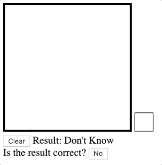

# Digit Recognition
This repo uses the `tensorflow` provided dataset `MNIST`.
The model is trained using `Python` and utilized in `Javascript` using the library `tensorflowjs`.

Two **deep learning models** were trained, "Convolutional Neural Network" and a "Regular Fully-connected Neural Network".
The `CNN` was primarily used for better accuracy.

# What it does
The application is able to predict which *digit number* (from 0 to 9) the user has drawn on the canvas. This is achieved by machine learning algorithms and `Javascript` implementations.

More, user is able to make corrections to the prediction, providing a correct answer. The model would then adjust itself.

# How to Run The Web App
This must be ran in a server, i.e. a **LocalHost**. You should open `code/main.html` in browser through your IDE.

# Preview


# Converting to Tensorflowjs model
Although the model is auto-converted in the python script, you may want to convert it yourself manually sometime. Under `Digit-Recognition` folder, run the following bash script in your terminal
```
tensorflowjs_converter --input_format keras \                       
                       model/cnn/cnn.model \    
                       model/cnn/json
```

Remember to rename the manually converted model `model.json` to `cnn.json`.
